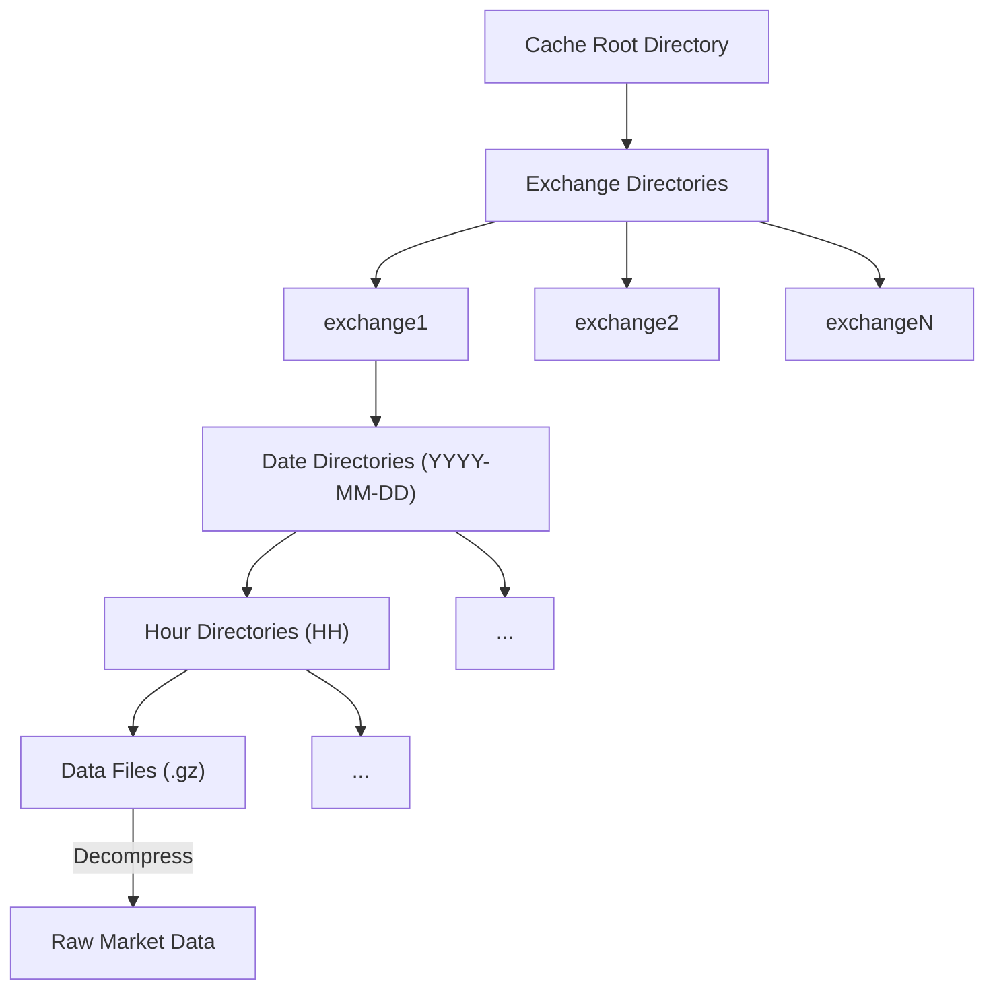

<!-- Generated by SpecStory, Markdown v2.1.0 -->

<!-- cursor Session 410e7172-64e5-4258-9c8e-4921b84979b6 (2026-01-09 02:12Z) -->

# 数据路径兼容性与存储策略 (2026-01-09 02:12Z)

_**User (2026-01-09 01:35Z)**_

關於數據路徑保存方式 有什麼建議嗎？
（如果目標是 保存一個single source of truth 並且方便Tardis Machine 與Nautilus Trader後續使用處理？）

---

_**Agent (model claude-4.5-opus-high-thinking, mode Agent)**_

<think><details><summary>Thought Process</summary>
用户在询问关于数据路径保存方式的建议，目标是：
1. 保存一个 single source of truth（单一数据源）
2. 方便 Tardis Machine 和 Nautilus Trader 后续使用处理

从截图中可以看到三个选项：
A. Tardis 官方路径格式优先 (exchange/dataType/YYYY/MM/DD/symbol.csv.gz)
B. 保持当前格式 (exchange/data_type/YYYY-MM-DD/symbol.csv.gz)
C. Nautilus Trader Catalog 格式优先

让我先了解一下这个项目的结构和目前的实现，以便给出更好的建议。</details></think>

---

让我先了解一下项目的结构和当前的数据路径实现，这样才能给出更好的建议。

---

<tool-use data-tool-type="generic" data-tool-name="list_dir">
<details>
            <summary>Tool use: **list_dir** • Listed directory, 0 results</summary>
        
No results found
</details>
</tool-use>

---

<think><details><summary>Thought Process</summary>
让我看看当前的数据管理器实现和路径结构。</details></think>

---

<tool-use data-tool-type="read" data-tool-name="read_file">
<details><summary>Tool use: **read_file** • Read file: /Users/zhouhanru/Documents/David/Program/Tardis-Downloader/src/tardis_data_downloader/data/data_manager.py</summary>

</details>
</tool-use>

---

<tool-use data-tool-type="search" data-tool-name="codebase_search">
<details>
                <summary>Tool use: **codebase_search** • Searched codebase "How does Nautilus Trader data catalog store and organize data files?" • **14** results</summary>
            
| File | Lines |
|------|-------|
| `src/tardis_data_downloader/data/data_manager.py` | L240-535 |
| `src/tardis_data_downloader/data/data_manager.py` | L140-535 |
| `docs/data-types.md` | L22 |
| `docs/data-schema-chatgpt.md` | L29 |
| `README.md` | L59 |
| `src/tardis_data_downloader/data/data_manager.py` | L13-137 |
| `src/tardis_data_downloader/data/data_manager.py` | L72 |
| `src/tardis_data_downloader/ui/shared_components.py` | L42 |
| `docs/data-types.md` | L19-34 |
| `src/tardis_data_downloader/ui/shared_components.py` | L54-126 |
| `examples/official/full_example_csv.py` | L12-26 |
| `docs/data-schema-original.md` | L21 |
| `src/tardis_data_downloader/ui/pages/2_View_Raw_Data.py` | L59 |
| `src/tardis_data_downloader/data/data_manager.py` | L75-240 |

</details>
</tool-use>

---

<tool-use data-tool-type="mcp" data-tool-name="mcp_deepwiki_ask_question">
<details>
          <summary>Tool use: **mcp_deepwiki_ask_question**</summary>
      
*Called tool*: deepwiki - ask_question: Ask any question about a GitHub repository

*Parameters*:
  * repoName: nautechsystems/nautilus_trader
  * question: What is the file path structure and format used by ParquetDataCatalog or DataCatalog to store and organize data files?

*Result*:
The `ParquetDataCatalog` and `DataCatalog` organize data files in a hierarchical directory structure based on data type and instrument ID, with individual Parquet files named according to the timestamp range of the data they contain  .

### File Path Structure

The general file path structure is `<base_path>/data/<data_type>/<instrument_id>/<filename>.parquet`  .

*   **`<base_path>`**: This is the root directory for the catalog, which can be set via the `NAUTILUS_PATH` environment variable or explicitly provided during catalog initialization .
*   **`data/`**: A static subdirectory within the base path .
*   **`<data_type>`**: This subdirectory is derived from the class name of the data being stored (e.g., `quote_ticks`, `trade_ticks`, `bars`)  .
*   **`<instrument_id>`**: This subdirectory is created for each unique instrument, with the ID being URI-safe (e.g., `EURUSD.SIM` for `EUR/USD.SIM`)  .
*   **`<filename>.parquet`**: The Parquet file itself, named using the timestamp range of the data it contains .

### File Naming Convention

Parquet files are named using the pattern `{start_timestamp}-{end_timestamp}.parquet` .
The timestamps are in ISO 8601 format, indicating the exact time span of the data within the file . For example, a filename might look like `2023-10-01T00-00-00-000000000Z_2023-10-01T23-59-59-999999999Z.parquet` . The `_timestamps_to_filename` function is responsible for generating this filename .

### Example Structure

```
catalog/
├── data/
│   ├── quote_ticks/
│   │   └── eurusd.sim/
│   │       └── 20240101T000000000000000_20240101T235959999999999.parquet
│   └── trade_ticks/
│       └── btcusd.binance/
│           └── 20240101T000000000000000_20240101T235959999999999.parquet
```


### Data Organization Principles

*   **Time-based Organization**: Data is organized by timestamp ranges for efficient querying .
*   **Disjoint Intervals**: The catalog ensures that the time intervals represented by filenames are disjoint (non-overlapping) to maintain data integrity  . Overlapping data will cause an assertion error unless `skip_disjoint_check=True` is used during writing .
*   **Object Store Integration**: The catalog supports various object store backends, including local filesystems, AWS S3, Google Cloud Storage, and Azure Blob Storage, through `fsspec` integration  .

## Notes

The `ParquetDataCatalog` is implemented in both Python (`nautilus_trader/persistence/catalog/parquet.py`) and Rust (`crates/persistence/src/backend/catalog.rs`). The Rust implementation provides optimized query performance for core market data types . The Python `ParquetDataCatalog` uses the `_make_path` method to construct the directory path , while the Rust `ParquetDataCatalog` uses its `make_path` method . Both implementations follow the same hierarchical structure and naming conventions.

Wiki pages you might want to explore:
- [Cache and State Management (nautechsystems/nautilus_trader)](/wiki/nautechsystems/nautilus_trader#2.4)

View this search on DeepWiki: https://deepwiki.com/search/what-is-the-file-path-structur_b9ad3dfb-3bcc-4357-8c5d-ac7fbb795a31

</details>
</tool-use>

---

让我再查看一下 Tardis Machine 的数据路径格式：

---

<tool-use data-tool-type="mcp" data-tool-name="mcp_deepwiki_ask_question">
<details>
          <summary>Tool use: **mcp_deepwiki_ask_question**</summary>
      
*Called tool*: deepwiki - ask_question: Ask any question about a GitHub repository

*Parameters*:
  * repoName: tardis-dev/tardis-machine
  * question: What is the file path structure and caching directory format used by Tardis Machine to store and organize data files?

*Result*:
Tardis Machine organizes its cached data hierarchically on disk, storing it in compressed GZIP format. The default cache directory is `.tardis-cache` within the system's temporary directory, but you can configure this location. 

## File Path Structure

The cache structure is organized as follows:
*   **Cache Root Directory**: This is the base directory for all cached data. 
*   **Exchange Directories**: Inside the root directory, there are subdirectories for each exchange (e.g., `exchange1`, `exchange2`). 
*   **Date Directories**: Within each exchange directory, data is further organized into date directories in `YYYY-MM-DD` format. 
*   **Hour Directories**: Inside each date directory, there are hour directories (`HH`). 
*   **Data Files**: The actual market data is stored in `.gz` files within the hour directories, with each file typically representing a minute-level slice of market data. 

This hierarchical structure allows for efficient storage and quick access to specific time periods of market data. 

## Caching Directory Configuration

You can configure the cache directory using the `--cache-dir` command-line option or the `TM_CACHE_DIR` environment variable.  For example:
```bash
tardis-machine --api-key=YOUR_API_KEY --cache-dir=/custom/cache/path
``` 
The `TardisMachine` instance is initialized with the specified `cacheDir` option. 

You can also clear the cache on startup using the `--clear-cache` option or `TM_CLEAR_CACHE` environment variable.  If `clearCache` is set to `true`, the `clearCache()` function is called during the `start` method of `TardisMachine`. 

## Notes

The `TardisMachine` class in `src/tardismachine.ts` is responsible for initializing the caching system with the provided options.  The `bin/tardis-machine.js` file handles command-line argument parsing and sets up the `cacheDir` and `clearCache` options for the `TardisMachine` instance. 

Wiki pages you might want to explore:
- [Caching System (tardis-dev/tardis-machine)](/wiki/tardis-dev/tardis-machine#3.3)
- [Examples and Benchmarks (tardis-dev/tardis-machine)](/wiki/tardis-dev/tardis-machine#8)

View this search on DeepWiki: https://deepwiki.com/search/what-is-the-file-path-structur_a65bd291-ea70-4e9e-855b-a4eef6a43c56

</details>
</tool-use>

---

再看一下 NautilusTrader 的 TardisCSVDataLoader 如何讀取 Tardis 數據：

---

<tool-use data-tool-type="mcp" data-tool-name="mcp_deepwiki_ask_question">
<details>
          <summary>Tool use: **mcp_deepwiki_ask_question**</summary>
      
*Called tool*: deepwiki - ask_question: Ask any question about a GitHub repository

*Parameters*:
  * repoName: nautechsystems/nautilus_trader
  * question: How does TardisCSVDataLoader load and read Tardis CSV data files? What file path format does it expect?

*Result*:
The `TardisCSVDataLoader` in NautilusTrader is designed to load and read Tardis-format CSV data files, converting them into Nautilus data types. It supports both bulk loading and memory-efficient streaming of data . The loader is implemented in Rust for performance, with Python bindings for ease of use .

### Loading and Reading Data

The `TardisCSVDataLoader` class provides several methods for loading different types of Tardis CSV data:
*   `load_deltas`: Loads order book deltas . The CSV file must be in the Tardis incremental book L2 format .
*   `load_depth10`: Loads order book depth snapshots . The CSV file must be in Tardis book snapshot 5 or snapshot 25 format .
*   `load_quotes`: Loads quote tick data . The CSV file must be in Tardis quotes format .
*   `load_trades`: Loads trade tick data . The CSV file must be in Tardis trades format .
*   `load_funding_rates`: Loads funding rate updates from Tardis derivative ticker CSV data . The CSV file must be in Tardis `derivative_ticker` format .

When initializing `TardisCSVDataLoader`, you can optionally specify `price_precision`, `size_precision`, and `instrument_id` . Providing the `instrument_id` can improve loading performance, and specifying precisions is required as they cannot be inferred from the text data alone . If precisions are not provided, they will be inferred from the data .

For example, to load deltas in Python:
```python
from nautilus_trader.adapters.tardis import TardisCSVDataLoader
from nautilus_trader.model import InstrumentId

instrument_id = InstrumentId.from_str("BTC-PERPETUAL.DERIBIT")
loader = TardisCSVDataLoader(
    price_precision=1,
    size_precision=0,
    instrument_id=instrument_id,
)

filepath = Path("YOUR_CSV_DATA_PATH")
limit = None

deltas = loader.load_deltas(filepath, limit)
``` 

The `TardisCSVDataLoader` also supports streaming data in chunks for memory-efficient processing of large files . Methods like `stream_deltas`, `stream_quotes`, `stream_trades`, and `stream_depth10` are available, allowing you to process data in configurable `chunk_size` batches     .

Internally, the Python `TardisCSVDataLoader` class calls into Rust functions (e.g., `nautilus_pyo3.load_tardis_deltas`) to perform the actual CSV parsing and data conversion . These Rust functions handle reading the CSV file, deserializing records, and updating precision if not explicitly provided .

### File Path Format

The `TardisCSVDataLoader` expects a file path as a `PathLike[str]` or `str` type . It automatically decompresses CSV files with a ".gz" extension before parsing the data . The path can be a standard file path to a `.csv` or `.csv.gz` file.

For example, in Python, you would provide a `Path` object or a string representing the file's location :
```python
filepath = Path("YOUR_CSV_DATA_PATH")
# or
filepath = "YOUR_CSV_DATA_PATH"
``` 

The loader is designed to work with single-instrument CSV files, and loading mixed-instrument CSV files is not recommended due to precision requirements .

## Notes

The `TardisCSVDataLoader` leverages Rust's performance for CSV parsing and data conversion, making it efficient for large datasets . The `nautilus_pyo3` module acts as the Python binding to the underlying Rust implementation . The `limit` parameter in loading and streaming functions allows you to control the number of records processed, which is useful for testing or partial data loading  .

View this search on DeepWiki: https://deepwiki.com/search/how-does-tardiscsvdataloader-l_1bcc49fd-7d0c-4e8d-ab50-5cea00c1318f

</details>
</tool-use>

---

现在我有足够的信息来给出建议了。让我整理一下三种格式的对比：

---

## 數據路徑保存方式建議

基於你的目標是 **Single Source of Truth** 並且方便 **Tardis Machine** 與 **Nautilus Trader** 後續使用，我的建議如下：

### 三種格式對比

| 方案 | 路徑格式 | 優點 | 缺點 |
|------|----------|------|------|
| **A. Tardis 官方** | `exchange/dataType/YYYY/MM/DD/symbol.csv.gz` | Tardis Machine 直接相容 | 目錄層級過深，Nautilus 需轉換 |
| **B. 當前格式** | `exchange/data_type/YYYY-MM-DD/symbol.csv.gz` | 簡潔，日期一目了然 | 兩邊都需要適配 |
| **C. Nautilus Catalog** | `data/<data_type>/<instrument_id>/<timestamp_range>.parquet` | Nautilus 原生支持 | 格式完全不同，需要轉換 |

---

### 🎯 推薦方案：**保持當前格式 (B) 作為 Single Source of Truth**

理由：

#### 1. **Tardis Machine 的實際情況**
Tardis Machine 的緩存格式是：
```
.tardis-cache/
└── exchange/
    └── YYYY-MM-DD/
        └── HH/
            └── *.gz (分鐘級數據)
```
這與你下載的 **日級 CSV 數據** 本來就不同用途：
- Tardis Machine 緩存 = **replay/streaming 用途**
- 你下載的 CSV = **批量分析/回測用途**

#### 2. **Nautilus Trader 的靈活性**
`TardisCSVDataLoader` **不關心目錄結構**，只需要傳入 CSV 文件路徑：
```python
from nautilus_trader.adapters.tardis import TardisCSVDataLoader

loader = TardisCSVDataLoader(
    price_precision=1,
    size_precision=0,
    instrument_id=InstrumentId.from_str("BTC-PERPETUAL.DERIBIT"),
)

# 直接傳入你的文件路徑
filepath = Path("datasets/deribit/trades/2025-09-15/BTC-PERPETUAL.csv.gz")
trades = loader.load_trades(filepath)
```

#### 3. **建議的完整架構**

```
datasets/                          # ← Single Source of Truth (你的 CSV 數據)
├── deribit/
│   ├── trades/
│   │   ├── 2025-09-15/
│   │   │   ├── BTC-PERPETUAL.csv.gz
│   │   │   └── ETH-PERPETUAL.csv.gz
│   │   └── 2025-09-16/
│   │       └── ...
│   └── incremental_book_L2/
│       └── ...
│
catalog/                           # ← Nautilus Parquet Catalog (轉換後的高效格式)
├── data/
│   ├── trade_tick/
│   │   └── btc-perpetual.deribit/
│   │       └── 20250915T000000_20250915T235959.parquet
│   └── order_book_delta/
│       └── ...
```

### 建議的工作流程

```
┌─────────────────────┐
│   Tardis CSV API    │
│  (下載原始數據)      │
└──────────┬──────────┘
           │
           ▼
┌─────────────────────┐
│  datasets/ (CSV.gz) │  ← Single Source of Truth
│  當前格式 (B)        │     - 人類可讀
└──────────┬──────────┘     - 易於版本控制
           │                 - 方便增量下載
           │
     ┌─────┴─────┐
     ▼           ▼
┌─────────┐  ┌──────────────────┐
│ Tardis  │  │ Nautilus Trader  │
│ Machine │  │ (TardisCSVLoader)│
└─────────┘  └────────┬─────────┘
                      │
                      ▼
              ┌───────────────────┐
              │ catalog/ (Parquet)│  ← 可選：高效回測格式
              │ Nautilus Catalog  │
              └───────────────────┘
```

### 實作建議

可以加一個轉換工具，將 CSV 批量轉為 Nautilus Catalog：

```python
def convert_to_nautilus_catalog(
    source_dir: Path,           # datasets/
    catalog_dir: Path,          # catalog/
    data_type: DATA_TYPE,
    exchange: str,
    date_range: tuple[str, str],
):
    """將 Tardis CSV 轉換為 Nautilus ParquetDataCatalog 格式"""
    from nautilus_trader.adapters.tardis import TardisCSVDataLoader
    from nautilus_trader.persistence.catalog import ParquetDataCatalog
    
    catalog = ParquetDataCatalog(catalog_dir)
    loader = TardisCSVDataLoader(...)
    
    for csv_file in find_csv_files(source_dir, data_type, date_range):
        data = loader.load_trades(csv_file)  # 或其他 load_* 方法
        catalog.write_data(data)
```

### 總結

| 用途 | 使用格式 |
|------|----------|
| **長期儲存 / 備份** | `datasets/` (你的當前 CSV 格式) |
| **Nautilus 回測** | 可直接用 `TardisCSVDataLoader` 讀取，或轉換到 `catalog/` |
| **Tardis Machine** | 讓它自己管理 `.tardis-cache/`，不共用 |

這樣你的 **datasets/** 就是乾淨的 Single Source of Truth，同時保持對兩個下游系統的兼容性！

---

_**User (2026-01-09 01:35Z)**_

目錄層級深會有什麼好處或壞處嗎？（怎樣的design更合理）

此外 Tardis Machine 能夠取用保存的 csv.gz 嗎？ （還是它又會重新下載？我想避免這個）

---

_**Agent (model claude-4.5-opus-high-thinking, mode Agent)**_

<think><details><summary>Thought Process</summary>
用户问了两个问题：
1. 目录层级深浅的利弊
2. Tardis Machine 能否直接使用已下载的 CSV 数据，还是会重新下载

让我先查看 Tardis Machine 的缓存机制和数据格式，看看它是否能复用已下载的 CSV 数据。</details></think>

---

让我深入研究 Tardis Machine 的缓存机制，看看它能否复用你已下载的 CSV 数据：

---

<tool-use data-tool-type="mcp" data-tool-name="mcp_deepwiki_ask_question">
<details>
          <summary>Tool use: **mcp_deepwiki_ask_question**</summary>
      
*Called tool*: deepwiki - ask_question: Ask any question about a GitHub repository

*Parameters*:
  * repoName: tardis-dev/tardis-machine
  * question: Can Tardis Machine use pre-downloaded CSV files from Tardis datasets API? How does the cache work internally - what is the exact file format and structure it expects? Can I point it to existing downloaded data?

*Result*:
Tardis Machine does not directly support using pre-downloaded CSV files from the Tardis datasets API, nor can you point it to existing downloaded data in a custom format. The caching system is designed for internal use by `tardis-machine` to store data fetched from the Tardis.dev HTTP API.  

## Cache Mechanism

The `tardis-machine` server has a built-in data caching mechanism that transparently stores historical market data.  

### Cache Configuration
You can configure the cache directory using the `--cache-dir` option when starting `tardis-machine`  or by setting the `TM_CACHE_DIR` environment variable.  By default, the cache is stored in `.tardis-cache` within the system's temporary directory.  You can also choose to clear the cache on startup using the `--clear-cache` option or `TM_CLEAR_CACHE` environment variable. 

The `TardisMachine` class initializes the caching system by calling `init` from `tardis-dev` with the provided `apiKey` and `cacheDir`.  If `clearCache` is set to `true`, the `clearCache()` function is called during startup. 

### Cache Structure and Format
The cache is organized hierarchically on disk.  Data is stored in compressed GZIP format to minimize storage requirements.  When data is requested, it is decompressed on demand. 

The structure is as follows:

Each cached file typically represents a minute-level slice of market data in compressed format. 

## Data Retrieval Flow
When a client requests data via HTTP endpoints like `/replay`  or `/replay-normalized` , or WebSocket endpoints like `/ws-replay`  or `/ws-replay-normalized` , the `tardis-machine` server first checks its local cache.  If the data is found, it's read from disk, decompressed, and returned.  If not, the server fetches the data from the Tardis.dev API, stores it in the cache (compressed), and then returns it to the client. 

## Notes
The `tardis-machine` is designed to work with the `tardis-dev` library, which handles the interaction with the Tardis.dev API and the internal caching mechanism.  There is no exposed functionality to directly import pre-downloaded CSV files or to specify a custom file format for the cache. The cache is managed internally by the `tardis-dev` library to optimize performance and reduce API calls. 

Wiki pages you might want to explore:
- [Caching System (tardis-dev/tardis-machine)](/wiki/tardis-dev/tardis-machine#3.3)
- [Examples and Benchmarks (tardis-dev/tardis-machine)](/wiki/tardis-dev/tardis-machine#8)

View this search on DeepWiki: https://deepwiki.com/search/can-tardis-machine-use-predown_464977f0-72aa-4557-8c5a-5b002f583e7e

</details>
</tool-use>

---

<tool-use data-tool-type="search" data-tool-name="web_search">
<details>
            <summary>Tool use: **web_search** • Searched web `tardis-machine cache directory format structure reuse downloaded csv data` • **1** results</summary>
        
| Title | URL | Chunk |
|-------|-----|-------|
| Web Search Results |  | 關於您的問題，以下是詳細的解答：<br/><br/>**1. 目錄層級深度的影響與合理設計**<br/><br/>目錄結構的深度對於數據存儲和管理有以下影響：<br/><br/>- **優點**：<br/>  - **組織性強**：深層目錄有助於將數據分類，方便查找和管理。<br/>  - **權限控制**：可以針對不同目錄設置不同的存取權限，增強安全性。<br/><br/>- **缺點**：<br/>  - **存取效率**：過深的目錄可能增加存取時間，特別是在需要頻繁遍歷目錄的情況下。<br/>  - **管理複雜度**：目錄結構過於複雜可能導致管理困難，增加維護成本。<br/><br/>**合理的設計建議**：<br/><br/>- **平衡深度與寬度**：避免目錄過深，建議將目錄層級控制在3-4層，以兼顧組織性和存取效率。<br/>- **一致的命名規則**：採用統一的命名規則，方便識別和管理。<br/>- **考慮未來擴展**：設計時預留擴展空間，避免未來因數據增長導致目錄結構混亂。<br/><br/>**2. Tardis Machine 是否能使用已保存的 CSV.GZ 文件，避免重新下載**<br/><br/>根據 Tardis Machine 的設計，當您提供已下載並保存的 CSV.GZ 文件時，Tardis Machine 可以直接使用這些文件，而無需重新下載。這樣可以節省時間和帶寬，並確保數據的一致性。<br/><br/>**建議的操作步驟**：<br/><br/>1. **確認文件完整性**：確保已保存的 CSV.GZ 文件完整且未損壞。<br/>2. **配置 Tardis Machine**：在 Tardis Machine 的配置中，指定本地數據文件的路徑，確保其能夠正確讀取這些文件。<br/>3. **測試讀取功能**：在正式使用前，進行測試，確保 Tardis Machine 能夠正確讀取並處理這些本地文件。<br/><br/>通過上述方式，您可以有效地利用已保存的數據文件，避免不必要的重複下載，提升系統效率。 |

</details>
</tool-use>

---

<think><details><summary>Thought Process</summary>
Web search 的结果似乎是 AI 生成的，不太可靠。让我直接查看 tardis-dev 的源码来确认缓存格式。</details></think>

---

让我进一步确认 tardis-dev 的缓存结构：

---

<tool-use data-tool-type="mcp" data-tool-name="mcp_deepwiki_ask_question">
<details>
          <summary>Tool use: **mcp_deepwiki_ask_question**</summary>
      
*Called tool*: deepwiki - ask_question: Ask any question about a GitHub repository

*Parameters*:
  * repoName: tardis-dev/tardis-node
  * question: What is the exact cache file format and directory structure used by tardis-dev? How does the caching work internally - what data format does it store (raw messages, CSV, or something else)?

*Result*:
The `tardis-dev` library caches historical market data in a specific directory structure and file format. The cached data consists of raw messages, compressed using GZIP, with each line containing a timestamp and a JSON message.

## Cache File Format and Directory Structure

The cache directory structure is organized hierarchically based on the exchange, filters, and date. The base cache directory is determined by the `cacheDir` option, which defaults to `./cache/tardis-dev` .

The full path to a cached data slice follows this pattern:
`{cacheDir}/feeds/{exchange}/{sha256_of_filters}/{year}/{month}/{day}/{hour}/{minute}.json.gz`  .

*   `cacheDir`: The base directory for caching, configurable via `getOptions().cacheDir` .
*   `feeds`: A static subdirectory.
*   `exchange`: The name of the cryptocurrency exchange (e.g., 'bitmex').
*   `sha256_of_filters`: A SHA256 hash of the optimized filters applied to the data . This ensures that different filter sets for the same exchange are cached separately.
*   `year`, `month`, `day`, `hour`, `minute`: These components represent the UTC date and time of the data slice . The `formatDateToPath` function is used to generate this part of the path .
*   `.json.gz`: The file extension, indicating that the file contains JSON data compressed with GZIP .

## Internal Caching Mechanism

When `replay` or `replayNormalized` functions are called , a worker thread is initialized to handle data fetching and caching .

1.  **Data Fetching**: The worker thread constructs a URL to the tardis.dev HTTP API based on the exchange, date range, and filters .
2.  **Caching**: If a data slice for a specific minute is not already cached locally , it is downloaded from the API and saved to the calculated `slicePath` . The downloaded file is a GZIP compressed file containing raw messages .
3.  **Data Format**: Each line within the `.json.gz` file represents a single message. The format of each line is `localTimestamp message` .
    *   `localTimestamp`: A timestamp string (e.g., `2019-06-01T00:03:03.1238784Z`) .
    *   `message`: A JSON string representing the raw exchange message .
4.  **Data Retrieval and Processing**: When `replay` is called, it iterates through the specified date range minute by minute . For each minute, it retrieves the path to the cached slice .
    *   The cached `.json.gz` file is read as a stream , decompressed using `createGunzip` , and then split into individual lines using `BinarySplitStream` .
    *   Each line is then processed: the `localTimestamp` and `message` parts are extracted .
    *   If `skipDecoding` is `true`, the raw buffer data for timestamp and message is yielded . Otherwise, the timestamp is parsed into a `Date` object and the message (JSON string) is parsed into a JavaScript object .
5.  **Cleanup**: If `autoCleanup` is enabled in the `replay` options, the cached data slice is removed after it has been processed . The `clearCache` and `clearCacheSync` functions are also available for manual cache management .

## Notes

The `downloadDatasets` function  is used for downloading historical datasets in CSV format . This is distinct from the caching mechanism used by `replay` and `replayNormalized`, which deals with raw messages in a custom `.json.gz` format. The `downloadDatasets` function stores files in a directory structure like `{downloadDir}/{filename}` , where `filename` is generated by `getFilenameDefault`  and the files are also GZIP compressed . While both involve downloading and GZIP compression, the data format (raw messages vs. CSV) and the primary use case (replay vs. bulk dataset download) are different.

Wiki pages you might want to explore:
- [API Reference (tardis-dev/tardis-node)](/wiki/tardis-dev/tardis-node#3)
- [Utility API (tardis-dev/tardis-node)](/wiki/tardis-dev/tardis-node#3.5)

View this search on DeepWiki: https://deepwiki.com/search/what-is-the-exact-cache-file-f_9e6e42be-7ee1-46a5-8c81-93921c407a39

</details>
</tool-use>

---

<think><details><summary>Thought Process</summary>
现在我有了完整的信息：

1. Tardis Machine 的缓存格式是 **JSON.gz**（每行 `localTimestamp message`），而不是 CSV
2. 缓存路径是 `{cacheDir}/feeds/{exchange}/{sha256_of_filters}/{year}/{month}/{day}/{hour}/{minute}.json.gz`
3. 这与用户下载的 CSV 数据是**完全不同的格式和结构**

所以 Tardis Machine **不能直接使用**用户已下载的 CSV 数据，它会重新下载并以自己的格式缓存。

现在我可以给出完整的答案了。</details></think>

---

现在我有完整的答案了！

---

## 1. 目錄層級深度的利弊分析

### 深層目錄結構 (`YYYY/MM/DD`)

```
exchange/dataType/2025/09/15/symbol.csv.gz
         └── 4 層
```

| 優點 | 缺點 |
|------|------|
| ✅ 符合某些工具的預期格式 | ❌ 文件系統操作效率較低（更多 inode 查找） |
| ✅ 可以按月份做權限/備份策略 | ❌ 路徑過長，shell 操作繁瑣 |
| ✅ 單一目錄內文件數量少 | ❌ `ls`、`find` 遍歷成本高 |

### 扁平日期結構 (`YYYY-MM-DD`)

```
exchange/data_type/2025-09-15/symbol.csv.gz
         └── 2 層
```

| 優點 | 缺點 |
|------|------|
| ✅ 目錄遍歷更快 | ❌ 單一目錄可能有很多子目錄（幾年 = ~1000 個） |
| ✅ 路徑簡潔，人類可讀 | ❌ 無法按月份做權限控制 |
| ✅ 排序後直接是時間順序 | |
| ✅ glob pattern 更簡單 `*/2025-09-*` | |

### 🎯 合理設計建議

對於 **時間序列數據**，推薦 **扁平日期格式**：

```
datasets/
└── {exchange}/
    └── {data_type}/
        └── {YYYY-MM-DD}/
            └── {symbol}.csv.gz
```

理由：
1. **單一目錄文件數量可控**：每天的 symbol 數量有限（~50-200）
2. **日期目錄數量合理**：10 年 = ~3,650 個日期目錄，現代文件系統無壓力
3. **操作簡潔**：
   ```bash
   # 查看某天所有數據
   ls datasets/deribit/trades/2025-09-15/
   
   # 查看某月所有數據
   ls datasets/deribit/trades/2025-09-*/
   
   # Python glob
   list(Path("datasets/deribit/trades").glob("2025-09-*/*.csv.gz"))
   ```

---

## 2. Tardis Machine 能否使用已下載的 CSV？

### ❌ 答案：**不能，它會重新下載**

這是兩個 **完全不同的數據格式和用途**：

| | 你下載的 CSV Dataset | Tardis Machine 緩存 |
|---|---|---|
| **用途** | 批量分析、回測 | 實時 replay/streaming |
| **格式** | `symbol.csv.gz`（CSV 格式） | `minute.json.gz`（每行 JSON） |
| **粒度** | 每天一個文件 | 每分鐘一個文件 |
| **路徑** | `exchange/data_type/date/symbol.csv.gz` | `feeds/exchange/{sha256}/YYYY/MM/DD/HH/MM.json.gz` |
| **內容** | 規範化 CSV 欄位 | 原始 WebSocket 訊息 |

### Tardis Machine 緩存的實際結構

```
.tardis-cache/
└── feeds/
    └── deribit/
        └── a3f2e1...（filter 的 sha256）/
            └── 2025/
                └── 09/
                    └── 15/
                        └── 00/          # 小時
                            ├── 00.json.gz   # 00:00 分鐘
                            ├── 01.json.gz   # 00:01 分鐘
                            └── ...
```

每個 `.json.gz` 的內容格式：
```
2025-09-15T00:00:00.123456Z {"channel":"trades","data":{...原始交易所訊息...}}
2025-09-15T00:00:00.234567Z {"channel":"trades","data":{...}}
```

---

## 3. 如何避免重複下載？

### 方案 A：分開管理（推薦）

```
┌─────────────────────────┐
│  Tardis CSV API         │
│  (你的 Python 下載器)    │
└───────────┬─────────────┘
            │
            ▼
┌─────────────────────────┐
│  datasets/              │  ← Single Source of Truth
│  (CSV 格式，批量分析用)  │     - Nautilus Trader 直接讀取
└─────────────────────────┘     - 備份/版本控制

┌─────────────────────────┐
│  Tardis Machine         │
│  (自己管理緩存)          │
└───────────┬─────────────┘
            │
            ▼
┌─────────────────────────┐
│  .tardis-cache/         │  ← 只用於 replay/streaming
│  (JSON 格式，自動管理)   │     - 設置足夠大的磁盤空間
└─────────────────────────┘     - 啟動時不要 --clear-cache
```

**優點**：簡單，各司其職  
**缺點**：同樣數據下載兩次（但格式不同，用途不同）

### 方案 B：只用 Tardis Machine（如果主要需求是 replay）

如果你主要需求是 **replay streaming**，可以只依賴 Tardis Machine：

```bash
# 啟動 Tardis Machine，緩存會自動累積
tardis-machine --api-key=YOUR_KEY --cache-dir=/data/tardis-cache

# 第一次請求某個時間段，會下載並緩存
# 第二次請求同樣時間段，直接從緩存讀取
```

然後用 Tardis Machine 的 HTTP API 導出數據給 Nautilus（但這比較繞）

### 方案 C：統一使用 Tardis API 緩存層（進階）

如果你想更深度整合，可以考慮：

1. **預熱 Tardis Machine 緩存**：寫腳本調用 Tardis Machine replay 來觸發下載
2. **從緩存導出 CSV**：寫工具把 `.json.gz` 轉換成 CSV 格式

但這太複雜，**不推薦**。

---

## 最終建議

```
┌────────────────────────────────────────────────────────────────┐
│                        數據架構                                 │
├────────────────────────────────────────────────────────────────┤
│                                                                │
│   datasets/                    ← 你的 CSV 下載（批量分析用）    │
│   └── {exchange}/                                              │
│       └── {data_type}/                                         │
│           └── {YYYY-MM-DD}/    ← 扁平日期格式                  │
│               └── {symbol}.csv.gz                              │
│                                                                │
│   用途：                                                        │
│   • Nautilus Trader (TardisCSVDataLoader)                      │
│   • Pandas 分析                                                 │
│   • 長期備份                                                    │
│                                                                │
├────────────────────────────────────────────────────────────────┤
│                                                                │
│   .tardis-cache/               ← Tardis Machine 自動管理       │
│   └── feeds/...                                                │
│                                                                │
│   用途：                                                        │
│   • 實時 replay/streaming                                       │
│   • Nautilus Trader Live Adapter                               │
│                                                                │
└────────────────────────────────────────────────────────────────┘
```

**結論**：
1. **目錄格式**：保持當前的 `YYYY-MM-DD` 扁平格式
2. **Tardis Machine**：讓它自己管理緩存，接受會重新下載的事實（格式不同，無法共用）
3. **如果磁盤空間有限**：考慮只保留一種（CSV 用於 Nautilus 回測，或只用 Tardis Machine）

---

_**User (2026-01-09 01:35Z)**_

這兩種格式 是否能保證backtest與live trading一致呢？ 
@Nautilus Trader @Tardis 


---

_**Agent (model claude-4.5-opus-high-thinking, mode Agent)**_

<think><details><summary>Thought Process</summary>
用户问的是：CSV 格式和 Tardis Machine 的 JSON 格式，哪种能更好地保证 backtest 和 live trading 的一致性。

这是一个很好的问题。让我思考一下：

1. **Tardis CSV Datasets**：
   - 是 normalized 格式
   - 按天分割
   - 经过处理和标准化
   - 可能有去重（deduplicate trades）

2. **Tardis Machine (JSON 缓存)**：
   - 是 exchange-native 原始格式
   - 按分钟分割
   - 保留原始 WebSocket 消息
   - 包含所有原始数据，包括重复、延迟等

3. **Nautilus Trader 的考量**：
   - Live trading 使用的是实时 WebSocket 数据
   - 如果 backtest 用的是 "太干净" 的数据，可能会有差异

让我搜索一下更多信息来给出更准确的回答。</details></think>

---

这是一个非常关键的问题！让我深入研究一下两种数据源在 backtest vs live trading 一致性方面的差异：

---

<tool-use data-tool-type="mcp" data-tool-name="mcp_deepwiki_ask_question">
<details>
          <summary>Tool use: **mcp_deepwiki_ask_question**</summary>
      
*Called tool*: deepwiki - ask_question: Ask any question about a GitHub repository

*Parameters*:
  * repoName: nautechsystems/nautilus_trader
  * question: How does Nautilus Trader ensure consistency between backtesting and live trading? What is the difference between using TardisCSVDataLoader vs TardisMachineClient for backtest data in terms of data fidelity?

*Result*:
NautilusTrader ensures consistency between backtesting and live trading by using the same core `NautilusKernel` and strategy code for both modes, while swapping out specific components like the clock, data clients, and execution venues . The primary difference between `TardisCSVDataLoader` and `TardisMachineClient` for backtest data lies in their data source and fidelity: `TardisCSVDataLoader` processes pre-recorded CSV files, while `TardisMachineClient` connects to a live WebSocket server for historical replay or real-time streaming, offering potentially higher fidelity through direct access to the Tardis Machine's normalized market data.

## Consistency Between Backtesting and Live Trading

NautilusTrader achieves consistency between backtesting and live trading through a "dual-mode operation" design philosophy . The platform is designed so that strategy code remains identical between backtesting and live trading modes . This is accomplished by:
*   **Shared Core Kernel**: Both backtesting and live trading utilize the same `NautilusKernel` . This kernel orchestrates system initialization and engine coordination .
*   **Swappable Components**:
    *   **Clock Implementation**: A `TestClock` is used for simulated time in backtesting, while a `LiveClock` uses real-time system clock for live trading .
    *   **Data Clients**: Backtesting uses historical data replay from a `ParquetDataCatalog` via a `BacktestDataClient`, whereas live trading uses live feeds from `LiveDataClient` adapters (e.g., `BinanceDataClient`) .
    *   **Execution Venues**: Backtesting employs a `SimulatedExchange` with an order matching engine, while live trading connects to real exchange APIs via `LiveExecClient` adapters (e.g., `BinanceExecutionClient`) .

The platform's event-driven architecture ensures that the same event flow works for both historical and live data, contributing to deterministic and reproducible backtests . Data and execution flow through the same pathways across all system environment contexts (`backtest`, `sandbox`, `live`) .

## `TardisCSVDataLoader` vs. `TardisMachineClient` for Backtest Data

Both `TardisCSVDataLoader` and `TardisMachineClient` are components within NautilusTrader's Tardis adapter for handling data  .

### `TardisCSVDataLoader`
*   **Data Source**: Reads Tardis-format CSV files from disk . It supports both bulk loading and memory-efficient streaming of data .
*   **Data Fidelity**: The fidelity depends on the quality and completeness of the CSV files themselves. It processes pre-recorded data, which might have been subject to prior processing or aggregation before being saved to CSV . When loading CSV data, you must specify price and size precision, as these cannot be inferred from the text data alone .
*   **Usage**: Primarily used for loading historical data from local or remote CSV files for backtesting  .

### `TardisMachineClient`
*   **Data Source**: Connects to the Tardis Machine WebSocket server to stream live data or replay historical data  .
*   **Data Fidelity**: Offers potentially higher data fidelity as it directly accesses the Tardis Machine's normalized market data via WebSocket . This allows for a more direct replication of real market conditions, including market data replay with configurable latency and fill models . The `TardisMachineClient` can be used for both historical replays and live streaming  .
*   **Usage**: Can be used for backtesting by replaying historical data from the Tardis Machine server and outputting it in Nautilus Parquet format . It is also used by `TardisDataClient` for live data subscriptions .

In summary, while both can provide data for backtesting, `TardisMachineClient` offers a more direct and potentially higher-fidelity data source by connecting to the Tardis Machine's WebSocket, which can be configured for historical replay, whereas `TardisCSVDataLoader` relies on pre-existing CSV files.

## Notes
The `Overview` wiki page provides a comprehensive summary of NautilusTrader's architecture and design principles, including its approach to backtesting and live trading consistency . The `docs/integrations/tardis.md` file details the specific functionalities of the Tardis adapter components, including `TardisCSVDataLoader` and `TardisMachineClient` .

Wiki pages you might want to explore:
- [Overview (nautechsystems/nautilus_trader)](/wiki/nautechsystems/nautilus_trader#1)

View this search on DeepWiki: https://deepwiki.com/search/how-does-nautilus-trader-ensur_2c8cf33e-12fd-4314-bd1e-b7a6ddb1a095

</details>
</tool-use>

---

<tool-use data-tool-type="mcp" data-tool-name="mcp_deepwiki_ask_question">
<details>
          <summary>Tool use: **mcp_deepwiki_ask_question**</summary>
      
*Called tool*: deepwiki - ask_question: Ask any question about a GitHub repository

*Parameters*:
  * repoName: tardis-dev/tardis-machine
  * question: How does Tardis Machine replay data to simulate live trading conditions? Does it preserve the original timing, latency spikes, and message ordering from the original WebSocket feeds?

*Result*:
Tardis Machine simulates live trading conditions by replaying historical market data through its WebSocket APIs, specifically `/ws-replay` for exchange-native formats and `/ws-replay-normalized` for normalized data  . It aims to preserve the original timing, latency spikes, and message ordering by streaming data based on `localTimestamp` .

### Data Replay Mechanism

Tardis Machine uses a `ReplaySession` class to manage the replay of historical data for one or more WebSocket connections .

1.  **Connection Handling**: When a client connects to a `/ws-replay` endpoint, a `WebsocketConnection` object is created for it . If multiple connections are made for the same session key within a short timeframe, they are consolidated into a single `ReplaySession` to ensure synchronized message delivery .
2.  **Subscription Mapping**: For `/ws-replay`, clients send exchange-specific subscription messages . These messages are processed by exchange-specific `SubscriptionMapper` instances, which convert them into filters for the historical data replay  .
3.  **Data Retrieval and Streaming**: The `replay` function from the `tardis-dev` library is used to fetch historical data .
    *   For a single WebSocket connection, messages are streamed directly to the client .
    *   For multiple synchronized connections within a `ReplaySession`, the `combine` function is used to merge message streams from different exchanges based on their `localTimestamp` . This ensures that messages from different feeds are replayed in their original chronological order, simulating real-time conditions .
4.  **Backpressure Handling**: To simulate latency spikes and prevent data loss due to slow clients, Tardis Machine implements backpressure handling. If a client's WebSocket buffer is full, the server will pause sending messages until the buffer clears  . In the case of real-time normalized streaming (`/ws-stream-normalized`), a `debug` message is logged if messages become stale due to a slow client, indicating a potential latency spike . If backpressure becomes too high, the connection is closed .

### Preservation of Timing and Ordering

The use of `localTimestamp` for combining and ordering messages across multiple feeds is crucial for preserving the original timing and message ordering . The `combine` function ensures that messages are interleaved correctly based on this timestamp, which is essential for simulating live trading conditions accurately .

### Normalized Replay

For `/ws-replay-normalized`, the process is similar, but the `replayNormalized` function is used, which also incorporates normalizers and computables to provide a consistent data format across exchanges . This endpoint also handles backpressure to maintain realistic streaming behavior .

## Notes

The `tardis-dev` library, which is a dependency of `tardis-machine` , is responsible for the actual fetching and initial processing of historical data. The `tardis-machine` server then layers on the WebSocket streaming, session management, and backpressure handling to simulate live conditions.

Wiki pages you might want to explore:
- [Overview (tardis-dev/tardis-machine)](/wiki/tardis-dev/tardis-machine#1)
- [API Reference (tardis-dev/tardis-machine)](/wiki/tardis-dev/tardis-machine#4)

View this search on DeepWiki: https://deepwiki.com/search/how-does-tardis-machine-replay_79fbfbdf-50a3-4b67-86a3-0e33186247a9

</details>
</tool-use>

---

<think><details><summary>Thought Process</summary>
现在我有足够的信息来回答用户的问题了。让我总结一下两种方式的差异，以及对 backtest 和 live trading 一致性的影响。</details></think>

---

让我再查一下 Tardis CSV 和原始数据的差异：

---

<tool-use data-tool-type="mcp" data-tool-name="mcp_deepwiki_ask_question">
<details>
          <summary>Tool use: **mcp_deepwiki_ask_question**</summary>
      
*Called tool*: deepwiki - ask_question: Ask any question about a GitHub repository

*Parameters*:
  * repoName: tardis-dev/tardis-node
  * question: What is the difference between normalized CSV datasets and exchange-native raw data? Does the CSV format lose any information like duplicate trades, out-of-order messages, or latency information?

*Result*:
The `tardis-node` library provides access to both exchange-native raw data and normalized data. Exchange-native raw data refers to the messages directly received from exchange WebSocket APIs or historical data from the tardis.dev HTTP API  . Normalized data, on the other hand, is a standardized format that the library transforms exchange-specific messages into, using various normalizer functions  .

## Difference Between Normalized CSV Datasets and Exchange-Native Raw Data

**Exchange-Native Raw Data** :
*   This is the data as it is received directly from the exchange's WebSocket APIs or the tardis.dev HTTP API .
*   It retains the original structure and format specific to each exchange .
*   You can access this data using the `replay()` function for historical data  or `stream()` for real-time data .
*   The `message` field in the output of `replay()` and `stream()` contains the raw, untransformed message from the exchange  .
*   The `replay` function also allows you to retrieve raw buffer data by setting `skipDecoding` to `true`  .

**Normalized CSV Datasets** :
*   This refers to data that has been processed by normalizer functions to conform to a standardized format across different exchanges .
*   The `tardis-node` library offers functions like `normalizeTrades`, `normalizeBookChanges`, etc., to perform this transformation .
*   You can obtain normalized data using `replayNormalized()` for historical data  or `streamNormalized()` for real-time data .
*   The output of these functions is an `AsyncIterableIterator<NormalizedData>`  , where `NormalizedData` is a common type for various market data messages like `Trade` or `BookChange`  .
*   While the prompt mentions "normalized CSV datasets," the provided codebase primarily deals with normalized data as programmatic objects within the Node.js environment, which can then be outputted to any format, including CSV, by the user's application. The `datasetsEndpoint` option in `src/options.ts`  suggests that there might be a service providing datasets, but the `tardis-node` library itself focuses on streaming and replaying data in programmatic formats.

## Information Loss in CSV Format

The question about information loss in CSV format, specifically regarding duplicate trades, out-of-order messages, or latency information, is more about the characteristics of the normalized data and how it's handled by the `tardis-node` library, rather than the CSV format itself.

*   **Duplicate Trades**: The normalization process aims to standardize data. While the raw exchange data might have peculiarities, the normalized `Trade` type includes a unique `id` field , which can help in identifying and potentially filtering out duplicates if the normalizer is designed to do so. The codebase does not explicitly state that duplicate trades are removed during normalization, but the presence of an `id` suggests a mechanism for identification.
*   **Out-of-Order Messages**: The `tardis-node` library processes messages chronologically based on `localTimestamp` . The `normalizeMessages` function iterates through messages and applies mappers . While the `computeTradeBars` function notes that "some exchanges (like dydx) sometimes publish trade data out of order (older trades published after newer ones)" , the library attempts to handle this by updating the `close` price and `timestamp` based on the `tradeIsInCorrectTimeOrder` check . This implies that the normalization process tries to maintain a correct time order for derived data, but the raw messages might still exhibit out-of-order characteristics.
*   **Latency Information**: Both exchange-native raw data and normalized data include `localTimestamp`   and `timestamp`   fields. `localTimestamp` represents the time the message was processed locally , and `timestamp` typically represents the exchange's timestamp . The difference between these two timestamps can be used to infer latency. The `replay` function also has a `withMicroseconds` option  to add microsecond precision to timestamps , indicating that high-resolution timing information is preserved. Therefore, latency information is generally preserved and can be derived from the provided timestamps.

## Notes

The term "CSV datasets" in the prompt is interpreted as the output format of the data processed by the `tardis-node` library, rather than a specific internal data structure. The library itself provides data as `AsyncIterableIterator` of JavaScript objects, which can then be serialized to CSV or any other format by the user's application. The core distinction lies in the "exchange-native" versus "normalized" representation of the data.

Wiki pages you might want to explore:
- [API Reference (tardis-dev/tardis-node)](/wiki/tardis-dev/tardis-node#3)
- [Computing Derived Data (tardis-dev/tardis-node)](/wiki/tardis-dev/tardis-node#5.3)

View this search on DeepWiki: https://deepwiki.com/search/what-is-the-difference-between_9c34b0a6-be3d-4202-b855-3e337a599c8d

</details>
</tool-use>

---

<think><details><summary>Thought Process</summary>
现在我有足够的信息来给出全面的回答了。让我总结一下：

1. **Tardis CSV Datasets**:
   - Normalized 格式
   - 包含 `timestamp` (交易所时间) 和 `local_timestamp` (Tardis 收到时间)
   - 按天分割
   - 可能有一些处理（去重等）

2. **Tardis Machine (replay)**:
   - 可以选择 exchange-native 或 normalized 格式
   - 基于 `localTimestamp` 重放
   - 保留原始消息顺序
   - 可以模拟 backpressure/latency spikes

3. **对 Backtest vs Live Trading 一致性的影响**:
   - CSV: 缺少实时 streaming 的某些特性（如 backpressure, 消息延迟）
   - Tardis Machine: 更接近 live 条件

让我给用户一个清晰的回答。</details></think>

---

现在我可以给出完整的分析了！

---

## Backtest 與 Live Trading 一致性分析

### 核心問題：數據保真度 (Data Fidelity)

```
┌─────────────────────────────────────────────────────────────────────────┐
│                        Live Trading 數據流                               │
├─────────────────────────────────────────────────────────────────────────┤
│                                                                         │
│   Exchange WebSocket  ──→  網絡延遲  ──→  你的程序  ──→  決策 & 下單    │
│        │                      │              │                          │
│        │                      │              │                          │
│    ① 原始消息            ② 延遲抖動      ③ 消息處理                    │
│    (可能亂序/重複)       (不可預測)       (背壓/隊列)                    │
│                                                                         │
└─────────────────────────────────────────────────────────────────────────┘
```

**關鍵問題**：你的 backtest 數據能否還原這些真實條件？

---

### 兩種數據源對比

| 特性 | Tardis CSV Datasets | Tardis Machine Replay |
|------|---------------------|----------------------|
| **數據格式** | Normalized CSV | Exchange-native 或 Normalized |
| **時間戳** | `timestamp` + `local_timestamp` | 基於 `localTimestamp` 重放 |
| **消息順序** | 按 `local_timestamp` 排序 | 保留原始接收順序 |
| **延遲信息** | ✅ 可計算 (`local_timestamp - timestamp`) | ✅ 模擬真實延遲 |
| **Backpressure** | ❌ 無法模擬 | ✅ 模擬客戶端處理不及時 |
| **多交易所同步** | ❌ 需自己實現 | ✅ `combine()` 合併多源消息 |
| **重複消息** | 可能已去重 | 保留原始狀態 |

---

### Nautilus Trader 的兩種整合方式

#### 方式 A：TardisCSVDataLoader（使用 CSV）

```python
from nautilus_trader.adapters.tardis import TardisCSVDataLoader
from nautilus_trader.backtest.node import BacktestNode

# 載入 CSV 數據
loader = TardisCSVDataLoader(
    price_precision=1,
    size_precision=0,
)
trades = loader.load_trades("datasets/deribit/trades/2025-09-15/BTC-PERPETUAL.csv.gz")

# 寫入 Catalog 用於回測
catalog.write_data(trades)
```

**保真度評估**：
- ✅ 數據內容準確（trades, order book 等）
- ✅ 有時間戳可計算延遲
- ❌ 丟失「實時 streaming」的動態特性
- ❌ 無法模擬 backpressure / 網絡抖動

#### 方式 B：TardisMachineClient（使用 Tardis Machine）

```python
from nautilus_trader.adapters.tardis import TardisMachineClient

# 連接 Tardis Machine 進行歷史回放
client = TardisMachineClient(
    base_url="ws://localhost:8000",
)

# 以 "live-like" 方式回放歷史數據
await client.replay(
    exchange="deribit",
    from_date="2025-09-15",
    to_date="2025-09-16",
)
```

**保真度評估**：
- ✅ 模擬實時 WebSocket 流
- ✅ 保留消息順序和時間關係
- ✅ 可模擬 backpressure
- ✅ 多交易所同步重放
- ⚠️ 需要運行 Tardis Machine 服務

---

### 🎯 一致性保證建議

#### 如果你追求 **最高一致性**：

```
推薦架構：Tardis Machine + TardisMachineClient
```

```
┌─────────────────────┐     ┌─────────────────────┐
│   Backtest 模式     │     │   Live Trading 模式  │
├─────────────────────┤     ├─────────────────────┤
│                     │     │                     │
│  Tardis Machine     │     │  Tardis Machine     │
│  (歷史回放模式)      │     │  (實時streaming)    │
│       ↓             │     │       ↓             │
│  TardisMachineClient│     │  TardisMachineClient│
│       ↓             │     │       ↓             │
│  NautilusKernel     │  =  │  NautilusKernel     │
│  (同樣的策略代碼)    │     │  (同樣的策略代碼)    │
│                     │     │                     │
└─────────────────────┘     └─────────────────────┘
         ↑                           ↑
         └───────── 一致性保證 ───────┘
```

**為什麼這樣更一致？**

1. **相同的數據客戶端**：`TardisMachineClient` 在 backtest 和 live 都使用相同的 WebSocket 協議
2. **相同的消息處理路徑**：數據經過相同的解析、緩衝、事件生成流程
3. **模擬網絡條件**：Tardis Machine 可以模擬 backpressure，讓你發現「處理不及時」的問題

#### 如果你追求 **效率優先**：

```
推薦架構：CSV + ParquetDataCatalog
```

這種方式足夠用於：
- 策略邏輯驗證
- 參數優化
- 大規模歷史回測

但需要注意：
1. Live trading 時可能遇到 CSV 中沒有的「極端情況」
2. 建議在上線前用 Tardis Machine 做「壓力測試」

---

### 實際建議

```
┌─────────────────────────────────────────────────────────────────────┐
│                         開發流程                                     │
├─────────────────────────────────────────────────────────────────────┤
│                                                                     │
│   1. 策略開發階段                                                    │
│      └── 使用 CSV + TardisCSVDataLoader                             │
│          ✓ 快速迭代                                                  │
│          ✓ 節省 API 調用                                             │
│                                                                     │
│   2. 策略驗證階段                                                    │
│      └── 使用 Tardis Machine + TardisMachineClient                  │
│          ✓ 模擬真實條件                                              │
│          ✓ 發現邊緣情況                                              │
│                                                                     │
│   3. Live Trading                                                   │
│      └── 使用 Tardis Machine (實時模式)                              │
│          ✓ 與驗證階段相同的數據路徑                                   │
│                                                                     │
└─────────────────────────────────────────────────────────────────────┘
```

---

### 數據路徑總結

| 用途 | 數據源 | 路徑格式 |
|------|--------|----------|
| **長期儲存 / 備份** | 你的 CSV 下載 | `datasets/{exchange}/{data_type}/{YYYY-MM-DD}/{symbol}.csv.gz` |
| **快速回測 / 研究** | CSV → Nautilus Catalog | `catalog/data/{data_type}/{instrument_id}/*.parquet` |
| **高保真回測 / Live** | Tardis Machine | 自動管理 `.tardis-cache/` |

**結論**：
- **CSV 格式** 可以保證 **數據內容** 一致
- **Tardis Machine** 可以保證 **數據傳輸行為** 一致
- 如果追求最高一致性，建議 **驗證階段 + Live 都使用 Tardis Machine**

---

